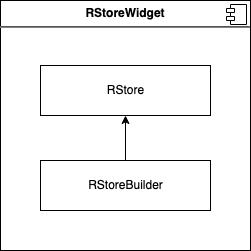

# RStore

RStore - это библиотека для state management во Flutter.

## Ключевые особенности

1. Расширяет возможности стандартного `State`:
- Перестраиваются только те виджеты, данные которых изменились
- Стейт прокидывается через контекст - есть доступ к стейту у любого дочернего виджета

2. Также просто работать как с обычным `State`:
- Не нужно управлять подписками
- Можно использовать простые типы данных без всяких обёрток
- Не нужно на каждую переменную создавать отдельную обёртку/отдельный стейт
- Обновления состояния по `setStore`, аналогично как `setState`

3. Работает стандартно, как принято во Flutter, без всякой скрытой магии:
- Зависимые от `RStore` виджеты строятся через `RStoreBuilder`
- `RStoreWidget` - позволяет создавать виджеты со встроенной `RStore` (аналогично как `StatefullWidget`)
- Механика очень схожа с `ValueListenableBuilder` и `ValueNotifier`
- Механика `RStoreBuilder`, `RStoreListener` и `RStoreConsumer` схожа с аналогичными виджетами в `bloc`

4. Легко прокидывать калбеки и входящие параметры головного виджета по дереву дочерних виджетов
- Через `RStore.widget` везде есть доступ к головному виджету

5. Встроенная упрощенная работа с таймерами:
- создание и отмена таймеров по id
- авто отмена таймеров по dispose

6. Встроенная поддержка автообновляемых/зависимых переменных:
- можно просто объявить переменные которые получают своё значение из future или stream
- можно объявлять переменные которые обновляются при обновлении других переменных
- механика похожа на `computed` данные из `Vue.js`

7. Встроенная упрощенная работа с подписками:
- создание и отмена подписок по id
- авто отписка по dispose
- можно подписаться на future (и не переживать что оно что-то будет пытаться обновить после dispose)
- можно подписаться на получения данных из двух потоков одновременно, для того чтобы их комбирировать (аналог `Rx.combineLatest2`)

Основная задача `RStore` приобразовать данные, чтобы их можно было
просто поместить на экран. Это его предназначение, на большее он не претендует.
Он не создан для общей логики всего приложения или нескольких экранов. Только
для внутреннего состояния конкретных виджетов.

Также `RStore` не претендует на роль полной замены других инструментов, на экономичность
к ресурсам и какое-то сверх быстродействие вычислений. Если ваш проект в это упирается,
то смело используйте другие инструменты или комбинируйте с ними, какие то вещи делайте
более тонко вручную, а не пытайтесь забить гвоздь микроскопом. Но в подавляющем большинстве
этого не требуется. Применяйте `RStore` к месту, а её место это стейт менеджмент
сложносоставного виджета, чаще всего экрана/страницы.

## Концепция

Хочется реализовать такой подход при котором из виджетов выносится максимум логики,
и их задачей становится просто отобразить готовые данные или дернуть нужную функцию.

Хочется сохранить простоту, такую же как при работе со `State` - объявляем
переменную без всяких оберток, пихаем её в нужный виджет, когда надо перестраиваем.
При этом хочется избавится избавится от всех недостатков стейта:
1. `State` намертво привязан к билдеру и физически даже находятся в одном классе.
2. При его изменении перестраивается вообще всё, а не то что изменились
3. Чтобы получить доступ к данным стейта нужно делать Prop Drilling (прокидывать их параметрами вниз)
4. Чтобы получить доступ к параметрам и калбекам головного виджета надо делать Prop Drilling
5. И обратная ситуация - когда нужно данные из калбека глубокого виджета передать вверх

Хочется при этом писать поменьше кода, а не как в `Bloc`, где нужно написать
огромную кучу всего - состояния, события, обработчики событий и
всё это потребуется даже для вывода пары-тройки значений. Или при внедрении
зависимости, например через `Provider`, где переменная внедряется скрытно и
ребилдит совершенно не прозрачно зависимые виджеты. А надо чтобы без магии,
максимально прозрачно, чтобы по стандартам Flutter: вот данные -
вот билдер на основе этих данных.

Хочется спрятать сложность - стримы, подписки, отписки, пусть всё это будет там внутри,
а снаружи максимально простой и понятный код. Чтобы для того чтобы пользоваться сторой,
не надо было изучать всякие сложные концепции на которых это строится. Просто взял и поехал,
а вся сложность где-то там далеко под капотом.

Хочется что снаружи наш виджет со сторой оставался всё темже виджетом с параметрами/калбеками.
А как устроена логика - это закрытая внутренняя кухня виджета. Чтобы свободно можно
было делать закрытые, законченные компоненты.

В поисках решения натолкнулся на [consumer](https://pub.dev/packages/consumer) -
то что надо! Только допилить напильником :)

## Установка

В `pubspec.yaml` добавить (сохранить и запустить pub get):

```yaml
dependencies:
  reactive_store:
    git:
      url: https://github.com/devmaslove/reactive_store
```

## Использование

Создаем класс с данными - много разных переменных
(наследник `RStore`). Далее просто "стора".

Добавляем отображение данных в дерево виджетов с помощью билдера
(например `RStoreBuilder`).

В билдере прописываем за изменениями каких переменных он будет следить
(список `watch`).

При изменении данных вызываем у сторы `setStore` для уведомления билдеров
что данные изменились.

Создаем класс с данными:

```dart
class MyAppStore extends RStore {
  int counter = 0;

  void incrementCounter() {
    setStore(() {
      counter++;
    });
  }
}

final store = MyAppStore();
```

Билдим данные в дерево виджетов:

```dart
@override
Widget build(BuildContext context) {
  return Scaffold(
    body: Center(
      child: RStoreBuilder<MyAppStore>(
        store: store,
        watch: (store) => [store.counter],
        builder: (context, store) => Text(
          '${store.counter}',
          style: Theme.of(context).textTheme.headline4,
        ),
      ),
    ),
    floatingActionButton: FloatingActionButton(
      onPressed: store.incrementCounter,
      child: const Icon(Icons.add),
    ),
  );
}
```

## RStoreWidget

Для удобства создания виджетов со сторой сделан виджет `RStoreWidget`:

```dart
class MyWidgetWithRStore extends RStoreWidget<MyAppStore> {
  @override
  MyAppStore createRStore() => MyAppStore();
  
  @override
  Widget build(BuildContext context, MyAppStore store) {
    return ...
  }

  @protected
  void initRStore(MyAppStore store) {
    store.init();
    ...
  }
}
```

Он уже содержит в себе `RStore`, который создается в методе `createRStore` -
этот метод обязателен для переопределения. Когда `RStore` создается через него,
то он дополнительно получает доступ к этому виджету `RStore.widget` после того,
как виджет будет смонтирован.

Если нужно как-то, дополнительно проинициализировать `RStore` после того как виджет
будет смонтирован, можно переопределить метод `initRStore`. В нем можно быть уверенным, что
`RStore` уже получил доступ к виджету. Переопределяется, при необходимости.

Также обязателен для переопределения метод `build`, на вход поступает контекст и стора.
И дополнительно стора пробрасывается вниз по дереву детей (доступна в `context` у детей
через `RStoreWidget.store<MyAppStore>(context)` или через `context.store<MyAppStore>()`).

Просто немного удобства, чтобы сразу в сторе иметь доступ ко входящим параметрам виджета, к
его калбекам, что это всё руками не пробрасывать.

Всю схему работы можно представить так:



## RStoreBuilder, RStoreValueBuilder и RStoreNamedBuilder

Для того чтобы подписаться на изменения переменных в сторе нужно использовать
список `watch` - список тех переменных за изменениями которых мы следим и при изменении
которых нужно перестроить виджет. Задаем его в `RStoreBuilder`:

```dart
RStoreBuilder<MyAppStore>(
  store: store,
  watch: (store) => [store.counter],
  builder: (context, store) {
    return Text(
      '${store.counter}',
      style: Theme.of(context).textTheme.headline4,
    );
  },
),
```

Параметр `store` не обязателен, если его не указывать то билдер будет сам
искать стору в текущем контексте, через `RStoreWidget.store<MyAppStore>(context)`.
Далее в примерах его указывать не будем.

Часто в виджетах нам требуется следить за изменением только одного значения в сторе
(как в примере выше), для этого можно использовать шаблон `RStoreValueBuilder`,
тут `watch` возвращает уже не список, а только одно значние, и это значение
также будет передаваться в `builder`:

```dart
RStoreValueBuilder<MyAppStore, int>(
  watch: (store) => store.counter,
  builder: (context, counter) {
    return Text(
      '$counter',
      style: Theme.of(context).textTheme.headline4,
    );
  },
),
```

Также можно сделать билдер который обновляется вручную по `name`
(в `setStore` можно указать массив `names` - те билдеры которые нужно обновить по имени).
Для этого используем шаблон `RStoreNamedBuilder`, в нём не будет списка `watch` вообще,
а вместо него нужно просто указать `name`:

```dart
RStoreNamedBuilder<MyAppStore>(
  name: 'counter',
  builder: (context, store) {
    return Text(
      '${store.counter}',
      style: Theme.of(context).textTheme.headline4,
    );
  },
),

...

// update builder by name
store.setStore(() => store.counter++, ['counter']);
```

Именованные билдеры не являются "чистой архитектурой", потому что создают зависимости в
обратную сторону, от сторы к билдерам. В идеальном мире нужно разделять отвественность -
стора ничего не должна знать о том где и как её используют и используют ли вообще.

Если вы не являетесь фанатичными приверженцами этих правил и/или живете в не идеальном мире,
в котором требуется быстро написать логику для отображения сложных структур данных, то для
упрощения работы можно использовать именованные билдеры. Но вы должны осознавать основной минус -
код становится связанным и запутанным.

Имена билдеров задавайте константами в сторе. Лучше задать всё в одном
месте и использовать от туда, чем копировать одинаковый "магический" текст по коду.

## RStoreListener, RStoreValueListener, RStoreBoolListener, RStoreStringListener и RStoreNamedListener

Если нам требуется следить за изменением значения в сторе без ребилда, чтобы,
например, перейти в другой экран при каком-то значении, то нужно использовать
шаблон `RStoreListener`. В него передаем дочерний виджет `child` и
определяем `onChange` - что делать при изменении значений в списке `watch`:

```dart
RStoreListener<MyAppStore>(
  watch: (store) => [store.counter],
  onChange: (context, store) {
    if (store.counter > 9) {
      Navigator.of(context).pop()
    }
  },
  child: ...,
),
```

Обратите внимание что функция `onChange` не вызывается при инициализации.

Когда требуется, мы можем следить изменением только одного значения с помощью
шаблона `RStoreValueListener`, где `watch` возвращает уже не список,
а только одно значние, и это значение также будет передаваться в `onChange`:

```dart
RStoreValueListener<MyAppStore, int>(
  watch: (store) => store.counter,
  onChange: (context, counter) {
    if (counter > 9) {
      Navigator.of(context).pop()
    }
  },
  child: ...,
),
```

Когда нужно, что-то сделать при установке `bool` флага, можно использовать
готовый шаблон `RStoreBoolListener`. В нем `watch` возвращает `bool` переменную
за которой следим и вместо передачи этого значение в `onChange` и последующей
проверки, сразу определяем функцию `onTrue` (или `onFalse`):

```dart
RStoreBoolListener<MyAppStore>(
  watch: (store) => store.showNextScreen,
  onTrue: (context) => Navigator.of(context).push(...),
  child: ...,
),
```

Аналогичная упрощенная форма есть для строк `RStoreStringListener`. В нем `watch`
возвращает `String` переменную, её значение передаётcя в функцию `onNotEmpty`.
Также можно определить функцию `onEmpty` - она вызовется когда переменной
будет присвоена пустая строка:

```dart
RStoreStringListener<MyAppStore>(
  watch: (store) => store.showScreen,
  onNotEmpty: (context, showScreen) => Navigator.of(context).pushNamed(showScreen),
  reset: (store) => store.showScreen = '',
  child: ...,
),
```

Обратите внивание, в этих двух слушателях также присутствует функция `reset` - её можно
определить если требуется сбросить значение после срабатывания. Если определена
функция `reset`, то будет вызвана также `store.setStore`. В примере выше это будет аналогично:
`store.setStore(() => store.showScreen = '')`, то есть перед `onNotEmpty`, переменная
`showScreen` будет сброшена.

И можно сделать слушатель который обновляется вручную по `name`
(в `setStore` можно указать массив `names` - те слушатели которые нужно обновить по имени).
Для этого используем шаблон `RStoreNamedBuilder`, в нём не будет списка `watch` вообще,
а вместо него нужно просто указать `name`:

```dart
RStoreNamedListener<MyAppStore>(
  name: 'counter',
  onChange: (context, store) {
    if (store.counter > 9) {
      Navigator.of(context).pop()
    }
  },
  child: ...,
),

...

// update listener by name
store.setStore(() => store.counter++, ['counter']);
```

Именованные слушатели не являются "чистой архитектурой", так как создает зависимости в обе стороны
(предостережение аналогичное как в `RStoreNamedBuilder`). Используйте с умом и осторожностью.

## RStoreConsumer

Когда нужен виджет, который объединяет в себе возможности и `RStoreBuilder` и `RStoreListener`
используем виджет `RStoreConsumer`. Это универсальный солдат: он может и билдится, и следить
за изменениями, и даже иметь сразу и лист `watch` и `name`. А также в него можно передать
виджет `child` который не должен ребилдится при изменении:

```dart
RStoreConsumer(
  store: store,
  watch: () => [store.counter],
  child: Text('Button has been pressed:'), // not be rebuilt
  builder: (context, child) {
    return Column(
      children: [
        child,
        Text('${store.counter}'),
      ],
    );
  },
  onChange: (context) {
    if (store.counter > 9) {
      Navigator.of(context).pop()
    }
  },
),
```

Обратите внимание, что стору этому виджету нужно передавать напрямую, он не будет сам
искать её в контексте. А остальные параметры у него не обязательны, так что
можно их комбинировать как угодно.

Комбинируя параметры можно добиться такого же поведения как `RStoreBuilder` или
`RStoreListener`. И на самом деле эти виджеты внутри возвращают `RStoreConsumer`
и по факту являются оберткой над ним.

## Дополнительные возможности RStore

### computed - самообновляемые зависимые данные

Когда нужно вывести модифицированную информацию из хранилища
добавляем геттер и оборачиваем в метод `computed`.

Вместо вычисляемого свойства, можно конечно использовать ту же самую функцию в качестве метода.
Вроде одно и то же. Но есть важное отличие: вычисляемые свойства кэшируются,
основываясь на своих зависимостях - `computed` вычисляет значение один раз по `getValue` и
кеширует его ключу `keyName`, а сбрасывается кэш при обновлении переменных списка `watch`
(билдеры будут обновляться только когда пересчитается исходное значение в списке `watch`).

Например, делаем геттер `doubleCounter` который возвращает удвоенное значение `counter`.
Для этого используем метод `computed` в котором говорим, что значение надо
пересчитать при обновлении `counter` и задаём уникальный ключ в кеше `"doubleCounter"`:

```dart
class MyAppStore extends RStore {
  int counter = 0;

  get doubleCounter => computed<int>(
        getValue: () => counter * 2,
        watch: () => [counter],
        keyName: "doubleCounter",
      );

  void incrementCounter() {
    setStore(() {
      counter++;
    });
  }
}
```

Таким образом билдеры зависимые от `doubleCounter` не будут обновляться в холостую
при каждом обновлении сторы, а пересчитаются только при изменении `counter`. Да,
кода надо писать порядком, но зато всё прозрачно. 

С помощью `computed` можно вычислять, например, сумму массива или мапить/фильтровать элементы.

### setTimer, setTimeout, setInterval и killTimer

Для простоты работы с таймерами сделана функция `setTimer` - это обертка над `Timer`.
Все созданные таймеры сами отменяются при уничтожении сторы, не нужно самим хранить
экземпляры таймеров и самим следить за `dispose`.

```dart
setTimer(
  duration: const Duration(seconds: 2),
  onTimer: () => setStore(() {
    showNextScreen = true;
  }),
);
```

Разные таймеры можно создавать, если задать разный `timerId`.
Если задать один и тотже `timerId`, то таймер перезапустится
(старый таймер будет отменен и за место него будет создан новый).
Можно не задавать `timerId`, тогда он будет сгенерирован автоматически,
функция `setTimer` вернет его номер (автоматически сгенерированые
идентификаторы имеют отрицательные значения).

```dart
setTimer(
  duration: const Duration(seconds: 2),
  onTimer: () => setStore(() {
    showNextScreen = true;
  }),
  timerId: 1,
);

setTimer(
  duration: const Duration(seconds: 1),
  onTimer: () => setStore(() {
    showHello = true;
  }),
  timerId: 2,
);
```

Для того чтобы еще упростить создание таймеров сделаны функции `setTimeout` и `setInterval`:

```dart
setTimeout(
  () => setStore(() {
    showNextScreen = true;
  }),
  2000,
);

setInterval(
  () => setStore(() {
    counter++;
  }),
  1000,
);
```

В них не надо указывать имена входящим параметрам, не надо создавать Duration -
он всегда в миллисекундах, не надо указывать параметр `periodic`.
`setTimeout` - одноразовый таймер, `setInterval` - периодический.
Синтаксис такой же ка в JavaScript.

Таймеры можно отменять и вручную по `timerId` в `killTimer` если это требуется.

### subscribe, listenStream, listenFuture и cancelSubscription

Для простоты работы с подписками на стримы сделана функция `subscribe` -
это обертка над `StreamSubscription`. Все созданные подписки сами отменяются
при уничтожении сторы, не нужно самим их хранить и самим следить за `dispose`.

```dart
subscribe<int>(
  stream: CountersRepository().observeItems(),
  subscriptionId: 1,
  onData: (counter) => setStore(() => this.counter = counter),
  onError: (error, stackTrace) => print("Error in Counters subscription: $error, $stackTrace"),
  debounceDuration: const Duration(milliseconds: 300),
);
```

`stream` - это поток с данными на который подписываемся (в данном примере поток с int)

Для разных подписок нужны разные `subscriptionId` идентификаторы, если задать одинаковые,
то подписка перезапуститься (старая подписка будет отменена и за место неё будет создана новая).
Если идентификатор не задавать, то он будет сгенерирован автоматически, функция `subscribe`
вернет его номер (автоматически сгенерированые идентификаторы имеют отрицательные значения).

Если данные приходят слишком быстро, то можно установить задержку в `debounceDuration`, в
этом случае значение попадет в `onData` только по истечении указанного времени, если за
этот промежуток прийдет еще одно значение, то уже оно будет возвращено по истечению, а
предыдущее игнорируется. Это бывает требуется для того чтобы не обновлять стору
(а вместе с тем и зависимые виджеты) слишком часто. Параметр задавать не обязательно.

Для того чтобы упростить создание подписки на поток сделана функция `listenStream`

```dart
listenStream<int>(
  CountersRepository().observeItems(),
  id: 1,
  msDebounce: 300,
  onData: (counter) => setStore(() => this.counter = counter),
  onError: (error, stackTrace) => print("Error in Counters subscription: $error, $stackTrace"),
);
```

В ней не надо указывать имя параметра `stream`, не надо создавать Duration в debounce -
он всегда в миллисекундах.

Также бывает требуется делать подписку из Future, для того чтобы её можно было отменить (ну или
она сама бы отменялась при уничтожении виджета со сторой), для этого сделана функция `listenFuture`

```dart
listenFuture<int>(
  CountersRepository().fetchLastCounter(),
  id: 2,
  onData: (counter) => setStore(() => this.counter = counter),
  onError: (error, stackTrace) => print("Error in Counters subscription: $error, $stackTrace"),
);
```

Подписки можно отменять вручную по `subscriptionId` в `cancelSubscription` если это требуется.

## Сниппеты кода

Чтобы было ещё удобнее с этим работать рекомендую добавить сниппеты кода:

### Android Studio - Life Template

```dart
import 'package:flutter/material.dart';
import 'package:reactive_store/reactive_store.dart';

class $STORE_NAME$ extends RStore {
  // TODO: add data here...

  @override
  $WIDGET_NAME$ get widget => super.widget as $WIDGET_NAME$;

  static $STORE_NAME$ of(BuildContext context) {
    return RStoreWidget.store<$STORE_NAME$>(context);
  }
}

class $NAME$ extends RStoreWidget<$STORE_NAME$> {
  const $WIDGET_NAME$({
    Key? key,
  }) : super(key: key);

  @override
  $STORE_NAME$ createRStore() => $STORE_NAME$();

  @override
  Widget build(BuildContext context, $STORE_NAME$ store) {
    return Container($END$);
  }
}
```

Где:

- Абреввиатура `rsw` - New RStore widget
- `Applicable context` - равно `Applicable in Dart: top-level.`
- `NAME` - начальная точка
- `WIDGET_NAME` - равно `NAME` + skip if defined
- `STORE_NAME` - равно `regularExpression(concat(WIDGET_NAME, "Store"), "^__", "_")` + skip if defined
- `END` - конечная точка

### VS Code - Code snippet

Добавьте сниппет для языка Dart: `.../snippets/dart.json`

User Snippets under File > Preferences (Code > Preferences on macOS),
and then select the Dart language.

```json
{
  "New RStore widget": {
    "prefix": "rsw",
    "body": [
      "import 'package:flutter/material.dart';",
      "import 'package:reactive_store/reactive_store.dart';",
      "",
      "class $1Store extends RStore {",
      "\t// TODO: add data here...",
      "",
      "\t@override",
      "\t$1 get widget => super.widget as $1;",
      "}",
      "",
      "\tstatic $1Store of(BuildContext context) {",
      "\t\treturn RStoreWidget.store<$1Store>(context);",
      "\t}",
      "",
      "class ${1:MyWidget} extends RStoreWidget<$1Store> {",
      "\tconst $1({",
      "\t\tKey? key,",
      "\t}) : super(key: key);",
      "",
      "\t@override",
      "\t$1Store createRStore() => $1Store();",
      "",
      "\t@override",
      "\tWidget build(BuildContext context, $1Store store) {",
      "\t\treturn Container($0);",
      "\t}",
      "}",
      "",
    ]
  }
}
```

## Хорошие практики

**Один "сложный" widget = один стор!** Если потребовалось подключать много сторов -
значит вам нужно вынести часть подвиджетов в отдельный "сложный" widget.
"Сложный" виджет наследуем от RStoreWidget.

**В сторе не делаем функции/методы на получение информации!** Информацию из хранилища получаем
только напрямую из переменных или геттеров. Если нужно как-то обработать данные
перед выводом - делаем геттер и оборачиваем в `computed`.

**Публичные функции/методы сторы только на мутацию данных!** И методы эти не должны что-то
возвращать. Остальную логику скрывать в приватных функциях.

**id таймеров/подписок задавать константами в сторе!** Лучше задать всё в одном
месте и использовать от туда, чем копировать одинаковый текст или магические числа по коду.

**Пересоздавайте объекты/мапы/листы в сторе вместо их мутации!** Watch списки сравнивают
сложные объекты по ссылке если у них не переопределен оператор равенства. Они просто не
узнают что что-то внутри объекта изменилось. Для совсем сложной логики и данных можно использовать
именованные билдеры, но лучше от этой практики воздерживаться.

**Большую стору выносите в отдельный файл .rstore.dart** Так видно где лежит стора и к какому
виджету/экрану она принадлежит (будет что то вроде `мой_виджет.rstore.dart`)

## Как это сделано

Под капотом это использует обычную механику Flatter`а:

- RStore - создает стримы которые пушатся по setStore
- RStoreConsumer - это StatefulWidget`ы которые подписываются на стримы из RStore
- Если watch лист изменился то вызывается setState и происходит ребилд (сравнение элементов в watch происходит по ссылке - по этому в RStore надо перезаписывать объект, чтобы подхватилось изменения)
- RStoreWidget оборачивает RStore в InheritedWidget и добавляет себя в RStore.widget
